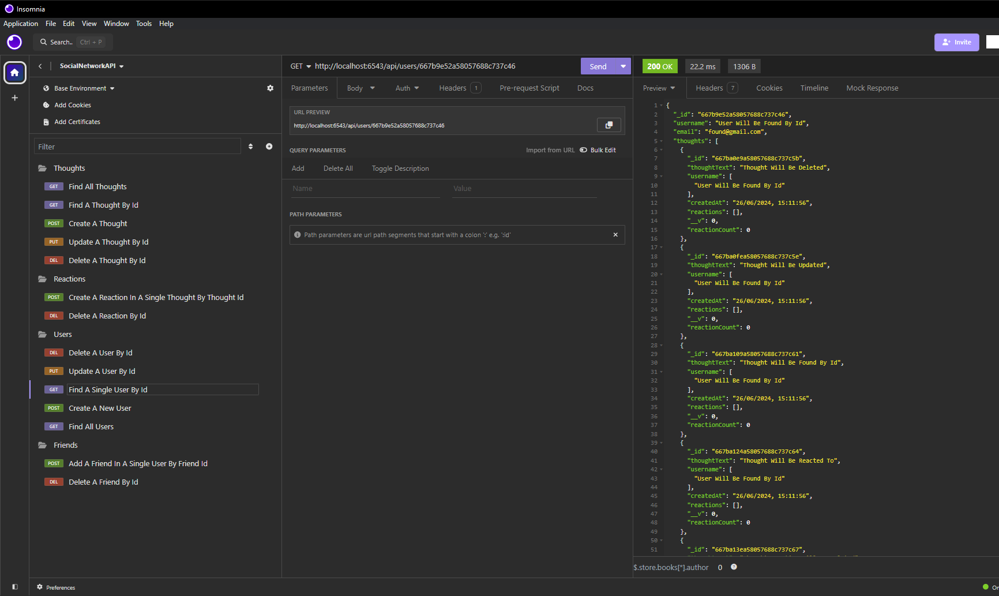

# Social Network API

## The Project

This project was designed as an API for a social network web application. It allows for users to be able to share their thoughts, react to friends thoughts and create a friend list. It also allows for modifications, deletions and reactions to existing thoughts. Other features include:

-   Automatically deleting attached thoughts and reactions when a user or thought is deleted.
-   Formatted timestamps on thoughts and reactions.
-   Automatic friend count for users.

## Link & Contents

-   [Video Walkthrough](https://www.loom.com/share/5ada080d54c44a7aa7a66ac667a9b68f?sid=0e0fd794-5997-41c4-a7b9-b2d6984494ac)
-   [Installation](#installation)
-   [Usage](#usage)
-   [Future Development](#future-development)
-   [Credits](#credits)
-   [Questions and Feedback](#questions-and-feedback)
-   [License](#license)

## Image

## Installation

-   Clone the repository to your local machine.
-   Ensure MongoDb is installed to local machine. Follow this [guide](https://coding-boot-camp.github.io/full-stack/mongodb/how-to-install-mongodb) if you need help.
-   Open gitbash or similar in the root folder.
-   Run "npm install".

## Usage

[Video Walkthrough](https://www.loom.com/share/5ada080d54c44a7aa7a66ac667a9b68f?sid=0e0fd794-5997-41c4-a7b9-b2d6984494ac)

After completing all installation instructions navigate to the root folder in gitbash or similar and enter "npm start".

Use Insomnia, Postman or something similar to test different request types.

Available endpoints are:

/api/users

-   GET all users
-   GET a single user by its \_id
-   POST a new user
-   PUT to update a user by its \_id
-   DELETE to remove user by its \_id - also removes a user's associated thoughts when deleted

/api/users/:userId/friends/:friendId

-   POST to add a new friend to a user's friend list
-   DELETE to remove a friend from a user's friend list

/api/thoughts

-   GET to get all thoughts
-   GET to get a single thought by its \_id
-   POST to create a new thought
-   PUT to update a thought by its \_id
-   DELETE to remove a thought by its \_id

/api/thoughts/:thoughtId/reactions

-   POST to create a reaction within a single thought's reactions
-   DELETE to pull and remove a reaction by the reaction's reactionId value

## Future Development

Ideas for future development include:

-   Adding specific error messages whenever a request is is unsuccesful eg. "User with that email address already exists" message to go along with the 404.
-   Additional fields such as likes on thoughts.
-   Making a compatible front end.

## Credits

Starter code provided by edX/Monash University.

Project requirements provided by edX/Monash University.

Project set by edX/Monash University. Made use of the Xpert learning assistant, AskBcs and our instructor with troubleshooting issues.

GitHub for hosting the repository.

Loom for the walkthrough video.

## Questions and Feedback

If you find any issues or have contributions or feedback you can do so by opening an [issue](https://github.com/Jiske-N/noSQL-SocialNetworkAPI/issues) on Github.

## License

None
